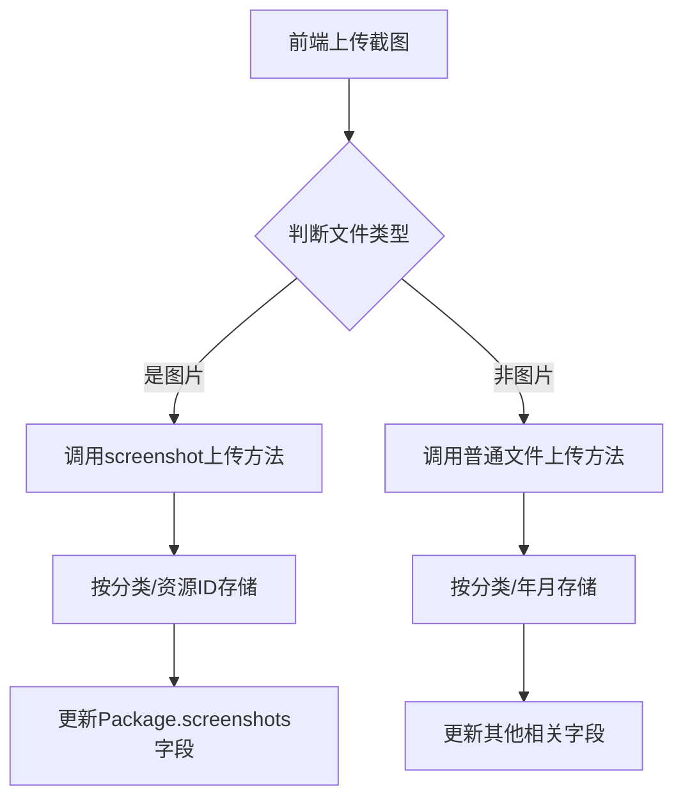

# 资源预览截图存储分类改进总结

## 🎯 改进目标

解决资源详情页面中截图、系统要求等内容不显示的问题，并完善截图在存储系统中的分类管理。

## 🔍 问题分析

### 1. 原始问题
- 用户上传资源后，在资源详情页面看不到截图、系统要求、包含文件等信息
- 数据库中新字段为空，说明发布和上传流程有问题

### 2. 根本原因
- **发布API问题**：发布时将screenshots设置为None，没有保存文件信息
- **上传流程问题**：图片上传成功后没有更新Package的screenshots字段
- **分类存储缺失**：所有文件混在一起，没有按截图、文件等分类存储

## ✅ 改进方案

### 1. 创建专门的截图上传方法

在`PackageStorageService`中新增`upload_package_screenshot`方法：

```rust
pub async fn upload_package_screenshot(
    &mut self,
    file_name: &str,
    file_data: Bytes,
    package_id: i32
) -> Result<UploadResult>
```

**特点：**
- 专门处理截图上传
- 按`screenshots/分类名称/资源ID/`路径分类存储
- 文件名格式：`screenshot_{package_id}_{随机ID}.{扩展名}`

### 2. 改进存储分类结构

**原结构：** `/image/分类名称/年月/文件`
**新结构（截图）：** `/screenshots/分类名称/资源ID/文件`
**普通文件：** `/files/分类名称/年月/文件`

**优势：**
- 截图按资源ID分组，便于管理
- 不同类型文件分别存储
- 支持资源级别的文件管理

### 3. 智能上传分发

修改`/storage/upload`接口，根据文件类型和context自动选择上传方法：

```rust
// 判断文件类型
let is_image = file_name.to_lowercase().ends_with(".jpg") ||
              file_name.to_lowercase().ends_with(".jpeg") ||
              file_name.to_lowercase().ends_with(".png") ||
              file_name.to_lowercase().ends_with(".gif") ||
              file_name.to_lowercase().ends_with(".webp");

// 智能分发
let upload_result = if is_image && package_id.is_some() {
    // 截图上传
    storage_service.upload_package_screenshot(file_name, file_data, package_id.unwrap()).await
} else {
    // 普通文件上传
    storage_service.upload_package_file(file_name, file_data, package_id).await
};
```

### 4. 自动更新Package字段

上传成功后自动更新Package的screenshots字段：

```rust
if is_image && package_id.is_some() {
    // 获取当前screenshots列表
    let mut screenshots = package.screenshots.unwrap_or_else(Vec::new);
    // 添加新上传的URL
    screenshots.push(result.download_url.clone());
    // 更新Package
    let _ = package_service.update_package(pkg_id, &update_req).await;
}
```

## 🏗️ 存储架构

### 目录结构示例
```
AList存储根目录/
├── screenshots/           # 截图专用目录
│   ├── 开发工具/          # 按分类分组
│   │   ├── 123/          # 按资源ID分组
│   │   │   ├── screenshot_123_a1b2c3d4.png
│   │   │   └── screenshot_123_e5f6g7h8.jpg
│   │   └── 124/
│   └── 设计资源/
└── files/                # 普通文件目录
    ├── 开发工具/
    │   └── 2024-01/
    └── 设计资源/
```

### URL格式示例
- **截图URL**: `https://alist.domain.com/screenshots/开发工具/123/screenshot_123_a1b2c3d4.png`
- **文件URL**: `https://alist.domain.com/files/开发工具/2024-01/file_a1b2c3d4_tool.zip`

## 🔧 技术实现

### 1. 新增方法
- `PackageStorageService::upload_package_screenshot()` - 专门处理截图
- 智能文件类型识别和分发逻辑
- 自动Package字段更新

### 2. 改进逻辑
- **发布流程**: 发布 → 上传文件 → 自动更新字段
- **存储分类**: 按文件类型和资源分组存储
- **URL管理**: 自动维护screenshots数组

### 3. 数据流程


## 🧪 测试验证

### 1. 上传测试
```bash
# 上传截图（with package_id）
curl -X POST \
  -F "file=@screenshot.png" \
  -F "package_id=123" \
  http://localhost:8080/api/v1/storage/upload
```

### 2. 存储验证
- 检查AList中是否按新目录结构存储
- 验证Package.screenshots字段是否正确更新
- 确认前端资源详情页面显示截图

### 3. 分类验证
- 不同分类的截图是否分开存储
- 相同资源的截图是否聚合在同一目录
- URL访问是否正常

## 📋 部署检查清单

- [ ] 数据库迁移已完成（添加screenshots等字段）
- [ ] 后端代码编译通过
- [ ] AList存储服务正常运行
- [ ] 前端发布页面正常工作
- [ ] 截图上传和显示功能正常

## 🎉 预期效果

1. **用户体验**：资源详情页面完整显示截图、要求、文件等信息
2. **存储管理**：截图按资源分组，便于管理和备份
3. **系统性能**：智能分发减少不必要的处理开销
4. **数据一致性**：上传与数据库字段自动同步

## 🔄 后续优化建议

1. **批量上传**：支持多张截图同时上传
2. **图片压缩**：自动压缩大尺寸截图
3. **缓存机制**：为截图添加CDN缓存
4. **管理界面**：管理后台支持截图预览和管理
5. **清理机制**：定期清理孤儿截图文件

---

**实施状态**: ✅ 代码修改完成，等待测试验证
**版本**: v1.0
**日期**: 2024-01-XX 