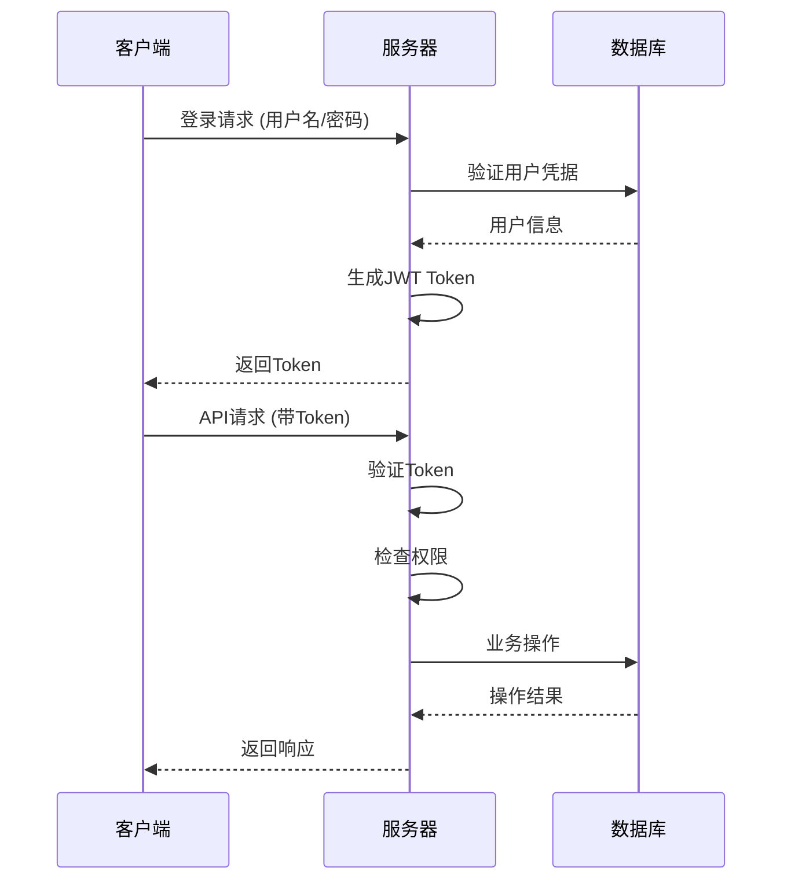

# 绳包管理器开发文档

## 📖 项目概述

绳包管理器是一个基于 Rust + Vue 3 的全栈Web应用，用于管理和分享各种绳包资源。系统采用前后端分离架构，提供用户管理、资源上传下载、评论系统、权限控制等功能。

### 🏗️ 技术栈

#### 后端 (Rust)
- **框架**: Actix-Web 4.4
- **数据库**: SQLite (Rusqlite)
- **认证**: JWT + BCrypt
- **邮件服务**: Lettre
- **日志**: Tracing + Log
- **配置**: Config + TOML

#### 前端 (Vue 3)
- **框架**: Vue 3.5 + TypeScript
- **UI库**: Element Plus 2.10
- **图表**: ECharts 5.6
- **图标**: Lucide Vue Next
- **状态管理**: Pinia
- **路由**: Vue Router 4.5
- **构建工具**: Vite 7.0

#### 部署
- **反向代理**: Nginx 1.28
- **静态资源**: 文件服务
- **API代理**: HTTP代理

## 🏛️ 项目架构

```
绳包管理器系统
├── 前端应用 (Vue 3)
│   ├── 用户界面层
│   ├── 路由管理
│   ├── 状态管理
│   └── API调用层
├── 后端服务 (Rust)
│   ├── HTTP服务层
│   ├── 中间件层
│   ├── 业务逻辑层
│   ├── 数据访问层
│   └── 数据库层
└── 反向代理 (Nginx)
    ├── 静态资源服务
    ├── API代理
    └── 负载均衡
```

### 📁 目录结构

```
项目根目录/
├── Rust_Vue/                      # 前端应用
│   ├── src/
│   │   ├── api/                   # API接口定义
│   │   ├── components/            # Vue组件
│   │   ├── views/                 # 页面视图
│   │   ├── router/                # 路由配置
│   │   ├── utils/                 # 工具函数
│   │   └── assets/                # 静态资源
│   ├── public/                    # 公共资源
│   └── dist/                      # 构建输出
├── rope-manager-backend/           # 后端服务
│   ├── src/
│   │   ├── api/                   # API路由
│   │   ├── models/                # 数据模型
│   │   ├── services/              # 业务逻辑
│   │   ├── repositories/          # 数据访问
│   │   ├── middleware/            # 中间件
│   │   └── utils/                 # 工具函数
│   ├── sql/                       # SQL脚本
│   ├── uploads/                   # 文件上传目录
│   └── logs/                      # 日志文件
├── nginx-1.28.0/                  # Nginx服务
│   ├── conf/                      # 配置文件
│   ├── html/                      # 静态资源
│   └── logs/                      # 访问日志
└── 文档和脚本/
    ├── 开发文档.md               # 本文档
    ├── start_fullstack.bat       # 全栈启动脚本
    └── complete_database_init.sql # 数据库初始化
```

## 🚀 快速开始

### 环境要求

#### 必须环境
- **Node.js**: >= 18.0
- **Rust**: >= 1.70 (推荐使用 rustup 安装)
- **Windows**: Windows 10/11 (Linux/macOS需适配脚本)

#### 推荐工具
- **VS Code**: 主要开发IDE
- **Git**: 版本控制
- **Postman**: API测试
- **SQLite Browser**: 数据库管理

### ⚡ 一键启动

```bash
# 克隆项目
git clone <项目地址>
cd 项目目录

# 一键启动全栈服务
start_fullstack.bat
```

启动后访问:
- **前端开发服务**: http://localhost:5173
- **后端API服务**: http://127.0.0.1:15201
- **生产环境**: http://localhost (需先部署)

### 🔧 手动安装配置

#### 1. 后端环境配置

```bash
# 进入后端目录
cd rope-manager-backend

# 安装Rust依赖
cargo build

# 创建配置文件
copy config.example.toml config.toml

# 初始化数据库
cargo run --bin rope-manager-backend
```

#### 2. 前端环境配置

```bash
# 进入前端目录
cd Rust_Vue

# 安装依赖
npm install

# 启动开发服务器
npm run dev
```

#### 3. Nginx配置

```bash
# 进入nginx目录
cd nginx-1.28.0

# 启动nginx（推荐使用管理脚本）
nginx_manager.bat start

# 或快速启动
start_nginx.bat
```

## 🔧 开发环境配置

### 后端开发配置

#### 配置文件 (config.toml)
```toml
[server]
host = "127.0.0.1"
port = 15201
database_url = "data.db"

[auth]
jwt_secret = "your-secret-key"
jwt_expiration = 86400

[mail]
smtp_server = "smtp.example.com"
smtp_username = "your-email"
smtp_password = "your-password"
```

#### 环境变量
```bash
# 日志级别
RUST_LOG=debug

# 数据库路径
DATABASE_URL=data.db
```

### 前端开发配置

#### 环境配置文件
```bash
# .env.development
VITE_API_BASE_URL=/api
VITE_APP_TITLE=绳包管理器 - 开发环境
VITE_DEBUG_API=true

# .env.production  
VITE_API_BASE_URL=/api
VITE_APP_TITLE=绳包管理器
VITE_DEBUG_API=false
```

#### Vite配置 (vite.config.ts)
```typescript
export default defineConfig({
  server: {
    proxy: {
      '/api': {
        target: 'http://127.0.0.1:15201',
        changeOrigin: true,
      }
    }
  }
})
```

## 🏗️ 开发流程

### 代码规范

#### Rust代码规范
- 使用 `cargo fmt` 格式化代码
- 使用 `cargo clippy` 进行代码检查
- 遵循 Rust官方编码标准
- 使用 `#[derive(Debug)]` 为结构体添加调试支持

#### Vue/TypeScript规范
- 使用 ESLint + Prettier 进行代码格式化
- 组件命名使用 PascalCase
- 文件命名使用 kebab-case
- 使用 TypeScript 严格模式

#### 提交规范
```bash
feat: 新功能
fix: 修复bug
docs: 文档更新
style: 代码格式调整
refactor: 重构代码
test: 测试相关
chore: 构建/工具相关
```

### 开发工作流

#### 1. 新功能开发
```bash
# 创建功能分支
git checkout -b feature/new-feature

# 后端开发
cd rope-manager-backend
cargo run

# 前端开发
cd Rust_Vue
npm run dev

# 提交代码
git add .
git commit -m "feat: 添加新功能"
git push origin feature/new-feature
```

#### 2. API开发流程

**后端API开发**:
```rust
// 1. 定义数据模型 (models/)
#[derive(Serialize, Deserialize)]
pub struct User {
    pub id: i32,
    pub username: String,
    // ...
}

// 2. 实现数据访问 (repositories/)
impl UserRepository {
    pub fn create_user(&self, user: &User) -> Result<()> {
        // 数据库操作
    }
}

// 3. 实现业务逻辑 (services/)
impl UserService {
    pub async fn register_user(&self, request: RegisterRequest) -> Result<User> {
        // 业务逻辑
    }
}

// 4. 定义API路由 (api/)
pub async fn register(request: Json<RegisterRequest>) -> Result<Json<ApiResponse<User>>> {
    // API处理逻辑
}
```

**前端API调用**:
```typescript
// 1. 定义API接口 (api/)
export const userApi = {
  register: (data: RegisterRequest): Promise<ApiResponse<User>> => {
    return api.post('/v1/auth/register', data)
  }
}

// 2. 在组件中使用
const handleRegister = async () => {
  try {
    const response = await userApi.register(formData)
    // 处理响应
  } catch (error) {
    // 错误处理
  }
}
```

#### 3. 数据库变更

```bash
# 1. 编写SQL迁移脚本
# sql/migrate_xxx.sql

# 2. 更新数据模型
# src/models/

# 3. 更新Repository层
# src/repositories/

# 4. 测试数据访问
cargo test
```

### 调试技巧

#### 后端调试
```bash
# 启用详细日志
RUST_LOG=debug cargo run

# 单元测试
cargo test

# API测试
powershell -File test_api.ps1
```

#### 前端调试
```bash
# 开发模式启动
npm run dev

# 类型检查
npm run type-check

# 构建测试
npm run build
```

#### 数据库调试
```bash
# 检查数据库架构
cargo run --bin check_db_schema

# 查看用户操作
cargo run --bin check_user_actions
```

## 🗄️ 数据库设计

### 核心表结构

#### 用户表 (users)
```sql
CREATE TABLE users (
    id INTEGER PRIMARY KEY AUTOINCREMENT,
    username TEXT UNIQUE NOT NULL,
    email TEXT UNIQUE NOT NULL,
    password_hash TEXT NOT NULL,
    role TEXT NOT NULL DEFAULT 'user',
    status INTEGER NOT NULL DEFAULT 1,
    created_at TEXT NOT NULL,
    updated_at TEXT NOT NULL
);
```

#### 资源包表 (packages)
```sql
CREATE TABLE packages (
    id INTEGER PRIMARY KEY AUTOINCREMENT,
    name TEXT NOT NULL,
    description TEXT,
    author TEXT NOT NULL,
    version TEXT,
    category TEXT,
    file_path TEXT,
    status TEXT NOT NULL DEFAULT 'pending',
    created_at TEXT NOT NULL,
    updated_at TEXT NOT NULL
);
```

#### 评论表 (comments)
```sql
CREATE TABLE comments (
    id INTEGER PRIMARY KEY AUTOINCREMENT,
    user_id INTEGER NOT NULL,
    package_id INTEGER NOT NULL,
    content TEXT NOT NULL,
    status TEXT NOT NULL DEFAULT 'active',
    created_at TEXT NOT NULL,
    FOREIGN KEY (user_id) REFERENCES users(id),
    FOREIGN KEY (package_id) REFERENCES packages(id)
);
```

### 数据访问层

#### Repository模式
```rust
pub trait UserRepository {
    fn create(&self, user: &CreateUserRequest) -> Result<User>;
    fn find_by_id(&self, id: i32) -> Result<Option<User>>;
    fn find_by_username(&self, username: &str) -> Result<Option<User>>;
    fn update(&self, id: i32, updates: &UpdateUserRequest) -> Result<User>;
    fn delete(&self, id: i32) -> Result<()>;
}
```

## 🔐 认证与权限

### JWT认证流程



### 权限体系

#### 角色定义
- **admin**: 系统管理员，拥有所有权限
- **elder**: 资深用户，可以审核资源
- **moderator**: 版主，可以管理评论
- **user**: 普通用户，基础功能

#### 权限检查中间件
```rust
pub async fn check_permission(
    req: ServiceRequest,
    credentials: BearerAuth,
) -> Result<ServiceRequest, (Error, ServiceRequest)> {
    // Token验证
    // 角色检查
    // 权限验证
}
```

## 📁 文件管理

### 文件上传流程

```rust
pub async fn upload_file(
    mut payload: Multipart,
) -> Result<Json<ApiResponse<UploadResponse>>> {
    while let Some(item) = payload.try_next().await? {
        let mut field = item?;
        let filename = field.content_disposition().get_filename();
        
        // 文件验证
        // 保存文件
        // 返回文件信息
    }
}
```

### 文件存储结构
```
uploads/
├── packages/           # 资源包文件
│   ├── user_1/
│   └── user_2/
├── avatars/           # 用户头像
└── temp/              # 临时文件
```

## 🎨 前端架构

### 组件结构

#### 布局组件
```vue
<!-- layouts/UserLayout.vue -->
<template>
  <div class="user-layout">
    <NavBar />
    <SideBar />
    <main class="content">
      <router-view />
    </main>
  </div>
</template>
```

#### 页面组件
```vue
<!-- views/user/UserProfile.vue -->
<template>
  <div class="user-profile">
    <UserInfo :user="user" />
    <UserActions @update="handleUpdate" />
  </div>
</template>

<script setup lang="ts">
import { ref, onMounted } from 'vue'
import { userApi } from '@/api/users'

const user = ref<User>()

onMounted(async () => {
  user.value = await userApi.getCurrentUser()
})
</script>
```

### 状态管理 (Pinia)

```typescript
// stores/user.ts
export const useUserStore = defineStore('user', {
  state: () => ({
    user: null as User | null,
    isAuthenticated: false,
  }),
  
  actions: {
    async login(credentials: LoginRequest) {
      const response = await authApi.login(credentials)
      this.user = response.data.user
      this.isAuthenticated = true
    }
  }
})
```

### 路由配置

```typescript
// router/index.ts
const routes = [
  {
    path: '/admin',
    component: () => import('@/views/admin/Dashboard.vue'),
    meta: { 
      requiresAuth: true, 
      requiresAdmin: true,
      roles: ['admin'] 
    }
  }
]
```

## 🚀 部署指南

### 开发环境部署

```bash
# 启动所有服务
start_fullstack.bat

# 访问应用
# 前端: http://localhost:5173
# 后端: http://127.0.0.1:15201
```

### 生产环境部署

#### 1. 构建前端应用
```bash
cd Rust_Vue
npm run build
```

#### 2. 部署到Nginx
```bash
cd nginx-1.28.0

# 自动部署前端
deploy_frontend.bat

# 启动nginx
nginx_manager.bat start
```

#### 3. 构建后端应用
```bash
cd rope-manager-backend

# 发布构建
cargo build --release

# 启动服务
target/release/rope-manager-backend
```

### Docker部署 (可选)

```dockerfile
# Dockerfile.backend
FROM rust:1.70 as builder
WORKDIR /app
COPY . .
RUN cargo build --release

FROM debian:bullseye-slim
COPY --from=builder /app/target/release/rope-manager-backend /usr/local/bin/
CMD ["rope-manager-backend"]
```

```dockerfile
# Dockerfile.frontend
FROM node:18 as builder
WORKDIR /app
COPY package*.json ./
RUN npm install
COPY . .
RUN npm run build

FROM nginx:alpine
COPY --from=builder /app/dist /usr/share/nginx/html
```

## 🧪 测试

### 后端测试

```bash
# 单元测试
cargo test

# 集成测试
cargo test --test integration_tests

# API测试
powershell -File test_api.ps1
```

### 前端测试

```bash
# 类型检查
npm run type-check

# 组件测试
npm run test

# E2E测试
npm run test:e2e
```

### 数据库测试

```bash
# 数据库架构检查
cargo run --bin check_db_schema

# 数据迁移测试
cargo run --bin migrate_test
```

## 📊 监控与日志

### 日志配置

#### 后端日志
```rust
// 配置日志级别
RUST_LOG=info,rope_manager_backend=debug

// 日志输出
log::info!("用户 {} 登录成功", username);
log::error!("数据库连接失败: {}", error);
```

#### 前端日志
```typescript
// utils/logger.ts
export const logger = {
  info: (message: string, data?: any) => {
    console.log(`[INFO] ${message}`, data)
  },
  error: (message: string, error?: any) => {
    console.error(`[ERROR] ${message}`, error)
  }
}
```

### 性能监控

#### 后端性能
- API响应时间监控
- 数据库查询性能
- 内存使用情况
- 并发请求处理

#### 前端性能
- 页面加载时间
- 组件渲染性能
- API请求耗时
- 用户交互响应

## 🔧 故障排除

### 常见问题

#### 后端问题
1. **端口占用**: 检查15201端口是否被占用
2. **数据库锁定**: 重启应用释放数据库连接
3. **权限错误**: 检查JWT Token和用户角色
4. **文件上传失败**: 检查uploads目录权限

#### 前端问题
1. **API调用失败**: 检查代理配置和后端服务状态
2. **路由跳转错误**: 检查路由配置和权限设置
3. **组件加载失败**: 检查组件导入路径
4. **构建失败**: 检查TypeScript类型错误

#### Nginx问题
1. **配置语法错误**: 运行 `nginx -t` 检查配置
2. **端口冲突**: 检查80端口占用情况
3. **静态文件404**: 检查文件路径和权限
4. **代理失败**: 检查后端服务状态

### 调试技巧

#### 开发调试
```bash
# 后端详细日志
RUST_LOG=debug cargo run

# 前端调试模式
npm run dev -- --debug

# 数据库调试
sqlite3 data.db ".tables"
```

#### 生产环境调试
```bash
# 查看nginx日志
nginx_manager.bat logs

# 查看后端日志
tail -f rope-manager-backend/logs/app.log

# 系统状态检查
nginx_manager.bat status
```

## 📈 性能优化

### 后端优化

#### 数据库优化
```sql
-- 添加索引
CREATE INDEX idx_users_username ON users(username);
CREATE INDEX idx_packages_category ON packages(category);
CREATE INDEX idx_comments_package_id ON comments(package_id);
```

#### 缓存策略
```rust
// 实现Redis缓存
pub struct CacheService {
    redis_client: redis::Client,
}

impl CacheService {
    pub async fn get<T>(&self, key: &str) -> Option<T> {
        // 缓存获取逻辑
    }
    
    pub async fn set<T>(&self, key: &str, value: &T, ttl: u64) {
        // 缓存设置逻辑
    }
}
```

### 前端优化

#### 代码分割
```typescript
// 路由懒加载
const routes = [
  {
    path: '/admin',
    component: () => import('@/views/admin/Dashboard.vue')
  }
]
```

#### 资源优化
```typescript
// vite.config.ts
export default defineConfig({
  build: {
    rollupOptions: {
      output: {
        manualChunks: {
          'vue-vendor': ['vue', 'vue-router'],
          'element-plus': ['element-plus'],
          'utils': ['axios', 'echarts']
        }
      }
    }
  }
})
```

## 🔮 扩展功能

### 计划功能

#### 短期目标
- [ ] 用户头像上传
- [ ] 高级搜索功能
- [ ] 批量操作支持
- [ ] 邮件通知系统

#### 中期目标
- [ ] Redis缓存集成
- [ ] 全文搜索 (Elasticsearch)
- [ ] 实时通知 (WebSocket)
- [ ] 移动端适配

#### 长期目标
- [ ] 微服务架构
- [ ] 多语言支持
- [ ] API版本管理
- [ ] 高可用部署

### 插件系统

```rust
// plugins/mod.rs
pub trait Plugin {
    fn name(&self) -> &str;
    fn init(&mut self) -> Result<()>;
    fn handle_request(&self, request: &Request) -> Result<Response>;
}

pub struct PluginManager {
    plugins: Vec<Box<dyn Plugin>>,
}
```

## 📞 支持与贡献

### 获取帮助

1. **查看文档**: 首先查阅本开发文档
2. **检查日志**: 查看系统日志定位问题
3. **搜索问题**: 在项目Issues中搜索相似问题
4. **联系团队**: 通过邮件或即时通讯联系开发团队

### 贡献指南

#### 贡献流程
1. Fork项目到个人仓库
2. 创建功能分支 (`git checkout -b feature/amazing-feature`)
3. 提交更改 (`git commit -m 'feat: 添加某个功能'`)
4. 推送到分支 (`git push origin feature/amazing-feature`)
5. 创建Pull Request

#### 代码贡献规范
- 遵循项目代码规范
- 添加必要的测试用例
- 更新相关文档
- 确保CI/CD通过

### 许可证

本项目采用 MIT 许可证，详情请查看 [LICENSE](LICENSE) 文件。

---

## 📝 更新日志

### v0.1.0 (2024-01-20)
- ✨ 初始版本发布
- ✅ 用户认证系统
- ✅ 资源管理功能
- ✅ 评论系统
- ✅ 管理员后台

---

**文档版本**: v1.0  
**最后更新**: 2024年1月20日  
**维护者**: 绳包管理器开发团队 